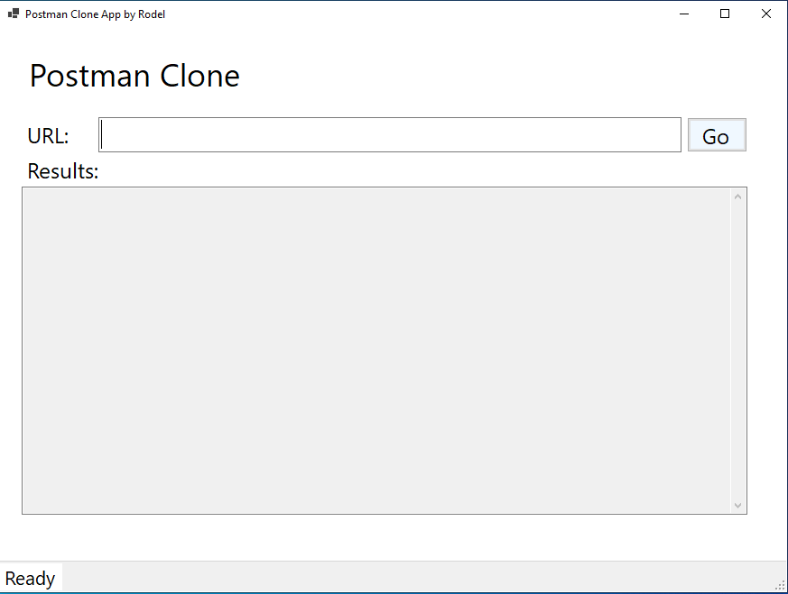
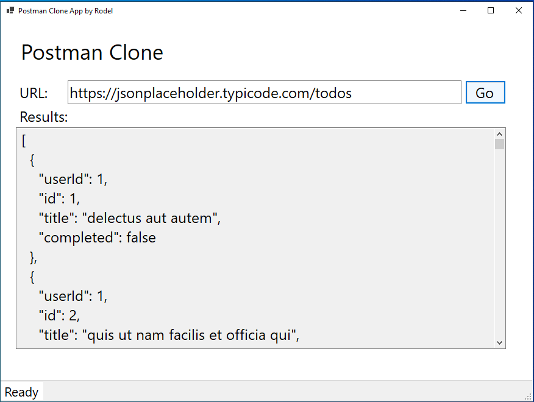

# PostmanCloneApp
The Postman Clone application is a user-friendly windows application for making GET requests to APIs and let's you view the response back in JSON format. This can help developoers test API calls in a simplified manner.

##Technlogies Used
* C#
* .NET 8
* WinForms
* HttpClient

## Using the App
1. Download the executable file from the release section.
2. When the application launches, it should look like this:

3. Fill in your API URL and hit GO:

## Upcoming changes. 
* Adding POST, PUT, PATCH, and DELETE functionality
* Adding API heaers
* Handling API Authentication
* Adding Dependency Injection
* Adding Logging
* Create a web-based user interface for the application
